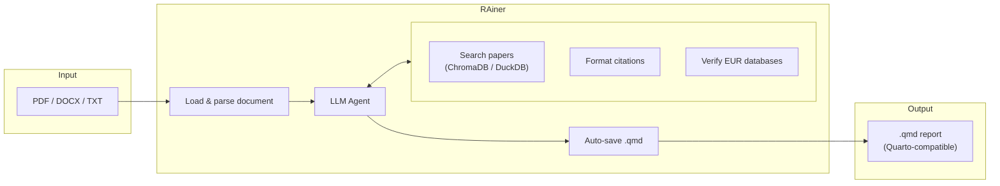
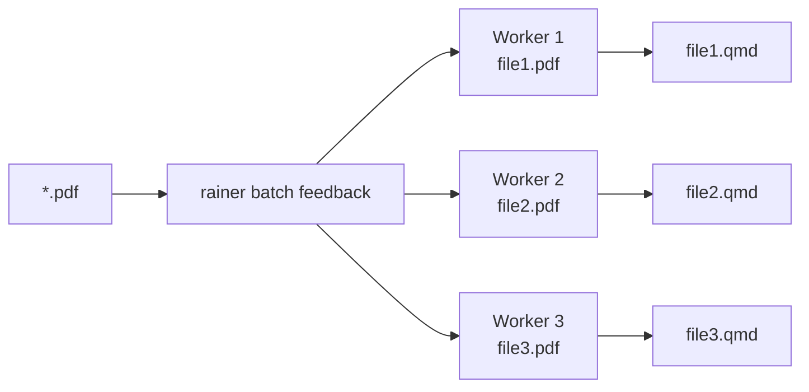

# RAiner

An open-source research assistant for academic work. Built to run locally with Ollama or cloud providers.

RAiner generates outputs as Quarto-compatible Markdown files (`.qmd`) by default, so you can directly render them with [Quarto](https://quarto.org). You can still override the filename/extension manually when saving.

## Features

- **Multiple modes**: Student feedback, final pre-submission thesis feedback, writing assistance, review reports, exam review, literature search
- **Batch processing**: Process multiple student submissions in parallel (`rainer batch feedback *.pdf`)
- **Vector search**: Find relevant papers using semantic search via ChromaDB
- **Pluggable corpus backend**: Local DuckDB + ChromaDB by default, or Postgres + pgvector for a deployed/multi-user setup (`data.backend`)
- **Fallback search**: Works with keyword search even before embeddings are created
- **Citation management**: Automatic formatting in multiple styles (inline, Quarto, BibTeX)
- **EUR database verification**: Verify data availability at Erasmus University Library (43 databases tracked)
- **Data feasibility audits**: Structured feedback on whether student research designs are feasible
- **Anti-hallucination controls**: Only cite papers from search results, verify database access claims
- **Session persistence**: Save and resume conversations
- **Provider flexibility**: Ollama (local/cloud), OpenAI, Anthropic, Google Gemini, OpenRouter, Azure OpenAI
- **MCP server**: Expose RAiner tools to Claude Desktop and other MCP-compatible clients
- **Embeddable engine**: `FeedbackEngine` facade for running one-shot feedback from external services (`from rainer import FeedbackEngine`)
- **File output**: Generate Quarto markdown reports with proper citations

## Installation

```bash
# Clone the repository
git clone https://github.com/yourusername/RAiner.git
cd RAiner

# Install with Poetry
poetry install

# Activate the virtual environment
poetry shell
```

## Quick Start

### 1. Copy and configure

```bash
mkdir -p ~/.config/rainer
cp config.example.yaml ~/.config/rainer/config.yaml
```

Edit `~/.config/rainer/config.yaml`:

```yaml
provider:
  name: ollama-cloud # or ollama for local
  model: qwen2.5:14b

data:
  duckdb_path: PATH TO DUCKDB
  chroma_path: PATH TO CHROMA
  chroma_collection: paper_abstracts
```

### 2. Set API key (for Ollama Cloud)

```bash
export OLLAMA_API_KEY="your_key_here"
```

### 3. Create embeddings (optional but recommended)

```bash
poetry run rainer-embed \
  --duckdb "/path/to/cite-hustle/DB/articles.duckdb" \
  --chroma "/path/to/cite-hustle/DB/chroma"
```

This embeds all paper abstracts for semantic search. Without this, RAiner falls back to keyword search.

### 4. Enable PDF support (optional)

```bash
poetry install --with pdf
```

This installs [docling](https://github.com/docling-project/docling) for parsing PDF, DOCX, PPTX, and other document formats. Without this, only text files (.txt, .md) are supported.

### 5. Run RAiner

```bash
# Interactive mode
poetry run rainer

# Batch mode (process multiple files)
poetry run rainer batch feedback submissions/*.pdf --workers 3

# MCP server (for Claude Desktop)
poetry run rainer-mcp
```

By default, RAiner saves reports as Quarto `.qmd` files, which are standard Markdown plus optional Quarto metadata. You can change the default extension in your config or pass a custom filename to `/save`.

## How It Works



**Interactive mode** processes one document at a time through the chat interface.
**Batch mode** runs the same pipeline on multiple files in parallel, each in its own worker process:



## Usage

### Interactive Mode

```bash
# Start RAiner
rainer

# (Optional) start in a specific base mode for the whole session
rainer --mode search

# Resume a session
rainer --resume abc123

# Load a document directly at startup
rainer --load draft.pdf
```

### Batch Mode

Process multiple files non-interactively with automatic .qmd output:

```bash
# Process all PDFs in a folder with 3 parallel workers
rainer batch feedback submissions/*.pdf --workers 3

# Sequential processing with a specific provider
rainer batch feedback draft1.pdf draft2.pdf -w 1 -p anthropic --model claude-sonnet-4-20250514

# Add extra instructions to the prompt
rainer batch feedback *.pdf -e "Focus on methodology and data feasibility"

# Custom output directory
rainer batch feedback *.pdf -o ./graded/
```

Each file gets its own session, agent, and output .qmd file. The filename's student name and draft title are automatically parsed into the YAML frontmatter.

### Commands

| Command                    | Description                                                  |
| -------------------------- | ------------------------------------------------------------ |
| `/help`                    | Show this help                                               |
| `/provider [name] [model]` | Show/switch LLM provider                                     |
| `/model <name>`            | Switch model                                                 |
| `/sessions`                | List recent sessions                                         |
| `/resume <id>`             | Resume a previous session                                    |
| `/load <file>`             | Load a draft/document (PDF, DOCX, MD, TXT)                   |
| `/loadpaper <file>`        | Load a reference paper (PDF) for writing mode                |
| `/review [extra prompt]`   | Run a structured review workflow on the loaded draft         |
| `/feedback [extra prompt]` | Run a structured student feedback report on the loaded draft |
| `/papers`                  | Show loaded reference papers                                 |
| `/save [filename]`         | Save conversation to a Quarto/Markdown file (default `.qmd`) |
| `/refs`                    | Show current reference list                                  |
| `/bibtex`                  | Show BibTeX entries                                          |
| `/stats`                   | Show database statistics                                     |
| `/info`                    | Show current session and draft status                        |
| `/clear`                   | Start new base session                                       |
| `/quit`                    | Exit                                                         |

### Workflows

#### Student Feedback workflow (`/feedback`)

After loading a draft with `/load`, run a structured student-facing feedback report:

- Research question and hypothesis assessment
- Data feasibility audit (verifies EUR database access)
- Literature gap identification with tool-backed citations
- Structured revision checklist

The agent automatically verifies whether required databases (WRDS, Compustat, Bloomberg, etc.) are available at EUR using the built-in EUR tools, and produces a structured report (executive summary, feasibility audit, revision checklist, etc.).

For the last full-draft check before MSc thesis submission, switch to `feedback_final` first. This mode is more pass-oriented: it gives a `PASS LIKELY / BORDERLINE / FAIL LIKELY` verdict, focuses on the minimum changes needed to pass, keeps data checks and citations, and includes a brief writing-style verdict.

```
/load "Student 01 – Draft proposal – v1 – 23 feb.pdf"
/feedback Focus on feasibility and clarity for a master thesis

# Final pre-submission thesis feedback
/mode feedback_final
/load "Student 01 – Full MSc thesis draft.pdf"
/feedback Focus on the minimum changes needed to make this thesis passable before submission
```

#### Writing Assistance (normal chat + `/loadpaper`)

Help write papers with proper Quarto-style citations. Load reference papers as PDFs to cite from, then ask the model to draft sections:

```
/loadpaper ~/papers/smith2020.pdf
Help me write an introduction about high-frequency trading, citing the loaded paper
```

#### Review Reports workflow (`/review`)

Write reviewer reports and check literature coverage on the loaded draft:

```
/load manuscript.pdf
/review Focus on major issues and missing key references
```

#### Literature Search (normal chat in base session)

Use the base session (default `search` mode) to find papers and get BibTeX entries:

```
Find papers about market maker inventory management after 2015
```

## Output Formats

### Inline Citations (feedback, review modes)

```
The evidence suggests price discovery occurs primarily in limit orders (Smith, 2020; Jones, 2021).
```

### Quarto Citations (writing mode)

```
The evidence suggests price discovery occurs primarily in limit orders [@smith2020; @jones2021].
```

### BibTeX (search mode, always available via `/bibtex`)

```bibtex
@article{smith2020,
  title = {Price Discovery in Limit Order Markets},
  author = {Smith, John and Doe, Jane},
  year = {2020},
  doi = {10.1234/example},
}
```

## EUR Database Verification

RAiner includes built-in verification of database access at Erasmus University Rotterdam. When reviewing student drafts, the assistant:

1. Checks if required databases are available via EUR subscriptions
2. Labels data sources as **VERIFIED** or **UNVERIFIED**
3. Suggests alternatives for unavailable databases

### Tracked Databases (43 total)

| Status            | Examples                                                  |
| ----------------- | --------------------------------------------------------- |
| **Active**        | WRDS, Compustat, CRSP, Orbis, LSEG Workspace, Morningstar |
| **Trial**         | PitchBook (until Nov 2025), Revelio Labs (until Jun 2026) |
| **Cancelled**     | Bloomberg (Apr 2024), RavenPack (Mar 2025)                |
| **Not Available** | FactSet, Capital IQ, Preqin, Audit Analytics              |

The database list is maintained in `rainer/data/eur_databases.json`. Update this file when EUR database access changes.

## Project Structure

```
RAiner/
├── pyproject.toml          # Poetry config
├── config.example.yaml     # Example configuration
├── README.md
├── CLAUDE.md               # Developer documentation
└── rainer/                 # Python package (lowercase!)
    ├── cli.py              # Terminal interface & argument parsing
    ├── agent.py            # Core agent with tool calling loop
    ├── batch.py            # Batch processing (parallel feedback/review)
    ├── config.py           # Pydantic configuration management
    ├── providers.py        # LLM provider adapters (Ollama, OpenAI, Anthropic, Google)
    ├── prompts.py          # Prompt loading (mode -> markdown template)
    ├── memory.py           # Session persistence (JSON)
    ├── papers.py           # DuckDB interface for paper metadata
    ├── search.py           # ChromaDB vector search
    ├── pdf.py              # Document parsing via docling (optional)
    ├── citations.py        # Citation formatting (inline, Quarto, BibTeX)
    ├── output.py           # Quarto/Markdown (.qmd) file generation
    ├── chunking.py         # Large document splitting
    ├── embed.py            # Embedding creation script
    ├── mcp_server.py       # MCP server for Claude Desktop integration
    ├── data/
    │   └── eur_databases.json  # EUR library database list
    └── prompts/            # System prompt templates per mode
        ├── feedback.md
        ├── writing.md
        ├── review.md
        ├── search.md
        └── exam-review.md
```

## Development

```bash
# Install with dev dependencies
poetry install

# Run tests
poetry run pytest

# Format code
poetry run ruff format .
poetry run ruff check --fix .
```

## Roadmap

- [x] Add OpenAI and Anthropic provider support
- [x] Add Google Gemini and OpenRouter provider support
- [x] EUR database verification tools
- [x] Data feasibility audits in feedback mode
- [x] PDF parsing via docling integration
- [x] Batch processing for multiple submissions
- [x] MCP server for Claude Desktop integration
- [ ] Export to Word documents

## License

MIT
